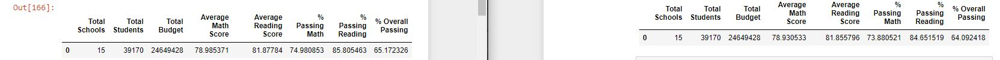
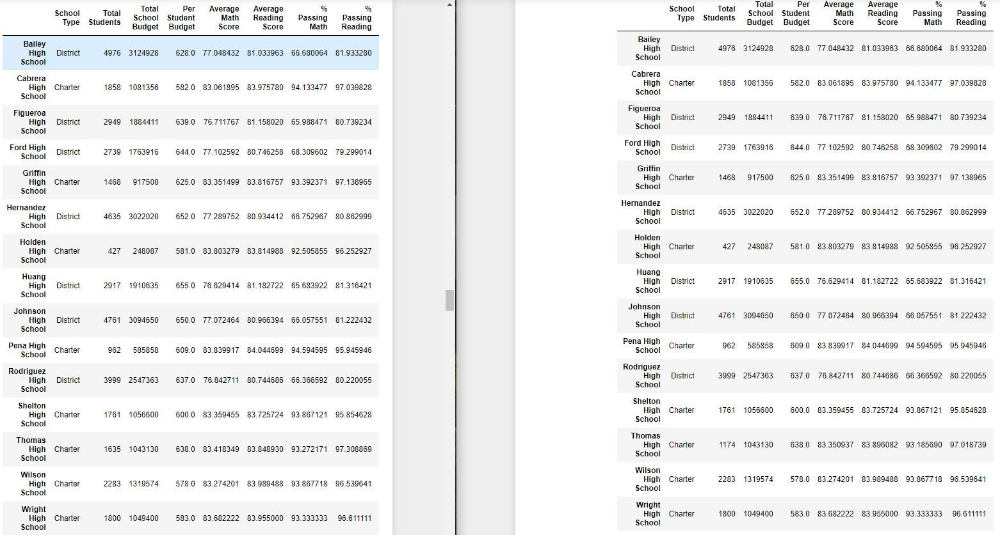

# School_District_Analysis
Analyzes csv file using Python with Pandas and Jupyter Notebook
- Reads through file with nearly 40,000 entries regarding schools and students
- Presents data in a summarized fashion for several different criteria (school, total students, student scores, budget)
- Challenge (summary below): dishonest grades and show how data changes

## District Summary
In terms of the district, upon removing the academically dishonest results, we can see that the average math score goes down by ~.05 points, the average reading by ~.02 points, and the overall % passing goes down by ~1.1%

## School Summary
For every other school other than Thomas High School 9th graders, the grades remain the same. This is because this is where the dishonesty was proven. We can see this shift in the summary of the schools.

## Comparatively
Comparatively, Thomas High School did the same as it did before: it is still in 2nd place out of the 15 schools. However, my code takes these 9th grade students at Thomas High School out of the student count entirely, rather than calculating their grades as nothing which likely changed the outcome. Giving them all 0's would have dropped the passing_overall % by the eqn:
{(new_overall_passing * new_count) + (0 * (new_count - old_count))} / (old_count) where the new student count is after removing the students. This gives:
(90.630324 * 1174)/1635 or 65.0764528294, putting Thomas High in 9th place for % Overall Passing.

## Change in scores by grade, school spending, size, and type
The Math and Reading scores were omitted intentionally (set to "NaN"). It hardly changes the others based on size and type, however it would change drastically if all students who had shown academic dishonesty were given 0's rather than removed from the equation.
